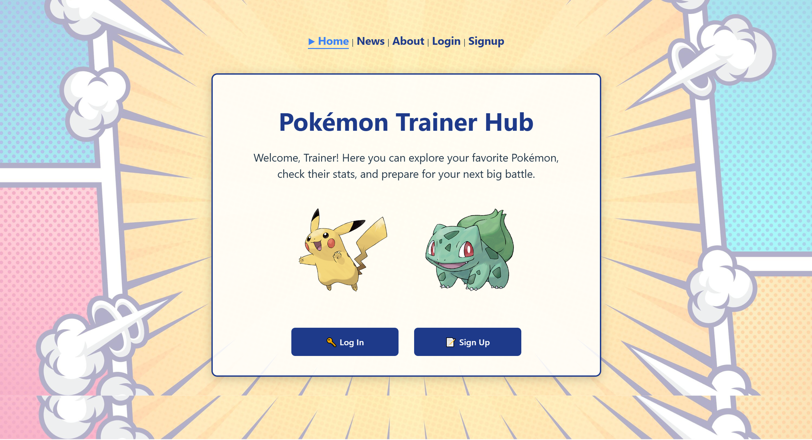
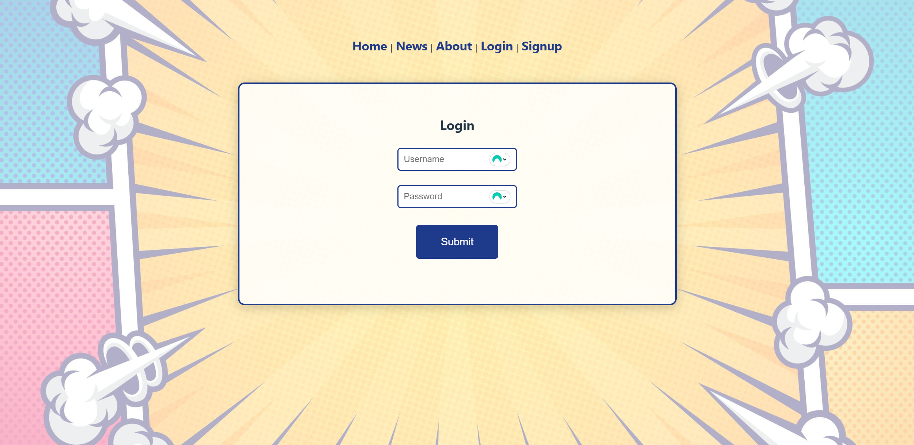
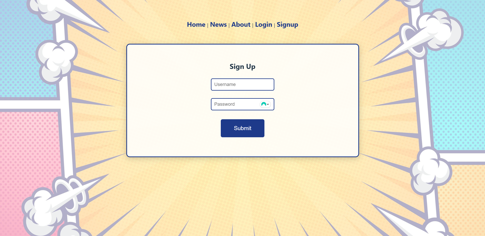

# Pokémon Trainer Hub

A full-stack demo application built to practice real-world fundamentals: REST API design, authentication with hashed passwords, connecting a React frontend to MongoDB Atlas, and deploying both sides to production (Netlify + Render).

Live Demo: https://lambent-dodol-53c843.netlify.app  
API: https://pokemon-trainer-hub.onrender.com/api

---

## 🚀 Features

- Authentication
  - Username/password signup & login
  - Server-side validation with bcrypt hashing
  - Local session state (localStorage)
- Comments Dashboard
  - Create / Edit / Delete / Like
  - MongoDB Atlas storage with Mongoose
  - Search filter with controlled inputs
  - Full CRUD connection between frontend and backend
- Pokémon Viewer
  - Live data from the public PokéAPI
  - Pokémon name, sprite, types
  - Client-side pagination & loading states
- News Page
  - Local JSON feed rendered as article list
  - Simulates a lightweight CMS integration

---

## 🏗️ Architecture Overview


The app follows a simple flow: React views call custom hooks, hooks use a small API client to talk to the Express backend, and the backend uses Mongoose models to read/write data in MongoDB Atlas.

## 🧠 Design Decisions

### Custom Hooks (useAuth, useComments)

- Separates UI from behavior
- Keeps pages declarative
- Centralizes auth & comments logic

### API Layer (src/api)

- Prevents components from calling endpoints directly
- Centralizes fetch logic and base URL handling
- Mirrors real-world frontend architecture

### Data Models (Mongoose)

- User: username + hashed password
- Comment: name, text, likes
- Simple schemas to focus on CRUD fundamentals

### Reasoning Behind These Choices

- Express: simple, explicit control over auth logic
- bcrypt: secure password hashing without JWT yet (scope control)
- MongoDB Atlas: easy hosted DB for a small demo
- React + Vite: fast dev cycle and type-safe UI
- Netlify + Render: separation of concerns + free-tier reproducibility

---

## 🖥 Frontend Tech Stack

- React 18 + TypeScript
- Custom hooks (useAuth, useComments)
- Fetch wrapper modules under `src/api`
- Minimal CSS + reusable card components

## 🛠 Backend Tech Stack

- Node.js + Express
- Mongoose models (User, Comment)
- Bcrypt password hashing
- REST endpoints for auth + comments

---

## 📦 Project Structure

```text
pokemon-trainer-hub/
├── server/
│   ├── models/
│   ├── routes/
│   └── server.js
├── src/
│   ├── api/
│   ├── components/
│   ├── hooks/
│   ├── views/
│   └── App.tsx
└── public/
```

---

## 🔧 API Endpoints

### Auth

- `POST /api/auth/register` — Register new user
- `POST /api/auth/login` — Login user

### Comments

- `GET    /api/comments` — List comments
- `POST   /api/comments` — Create a comment
- `PUT    /api/comments/:id` — Update a comment
- `DELETE /api/comments/:id` — Delete a comment

> Note: The PokéAPI is called directly from the frontend.

---

## 🛠 Running Locally

### Backend

```bash
cd server
npm install
cp .env.example .env
npm run dev
```

The API server runs at:

http://localhost:3000

### Frontend

```bash
# from repo root
npm install
npm run dev
```

The frontend runs at:

http://localhost:5173
(Vite default)

---

## 🔑 Env Vars

Frontend

- VITE_API_BASE=your-api-url

Backend

- MONGO_URI=your-atlas-uri
- PORT=3000

---

## 📈 Roadmap

- JWT-based authentication
- Comment pagination
- Improved error boundaries
- Role-based permissions
- Component-level refactor using shadcn/UI or Tailwind

---

## 📸 Screenshots

### Home



### News


### About


### Login



### Signup



### Dashboard


### Pokemon


